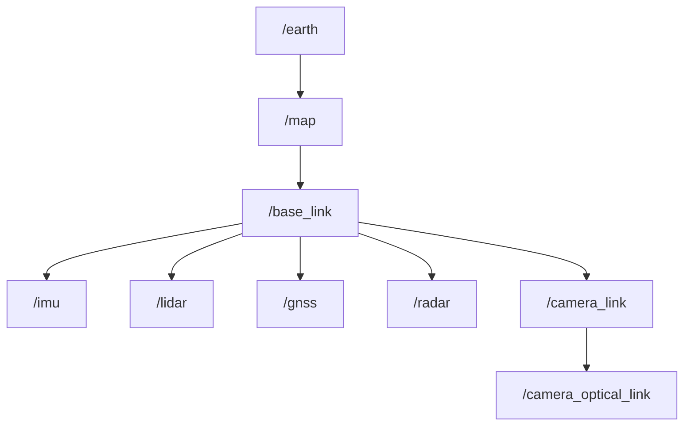

<a id="coordinate-system"></a>

# 坐标系

<a id="overview"></a>

## 概述

常用的坐标系包括世界坐标系、车辆坐标系和传感器坐标系。

- 世界坐标系是固定的坐标系，用于定义车辆所在环境中的物理空间。

- 车辆坐标系是车辆自身的坐标系，用于定义车辆在世界坐标系中的位置和朝向。

- 传感器坐标系是传感器自身的坐标系，用于定义传感器在车辆坐标系中的位置和朝向。

<a id="how-coordinates-are-used-in-autoware"></a>

## Autoware 如何使用坐标系

在 Autoware 中，坐标系通常用于表示车辆和障碍物在空间中的位置与运动。坐标系常用于路径规划、感知和控制，帮助车辆决定如何避开障碍物，并规划安全高效的行驶路径。

1. 传感器数据的变换

   在 Autoware 中，每个传感器都有独立的坐标系，其数据以该坐标系表示。为了关联不同传感器的独立数据，需要确定每个传感器与车身之间的位置关系。传感器在车身上的安装位置一旦确定，运行期间就保持固定，因此可以通过离线标定确定各传感器相对于车身的精确位置。

2. ROS TF2

   `TF2` 系统维护一棵坐标变换树，表示不同坐标系之间的关系。每个坐标系都有唯一名称，并通过坐标变换相互连接。有关 `TF2` 的使用方法，请参阅 [TF2 教程](http://docs.ros.org/en/galactic/Concepts/About-Tf2.html)。

<a id="tf-tree"></a>

## TF 树

在 Autoware 中，常见的坐标系结构如下所示：



- earth：`earth` 坐标系使用大地经度、纬度和高程描述地球上任意点的位置。在 Autoware 中，`earth` 坐标系仅用于 `GnssInsPositionStamped` 消息。

- map：`map` 坐标系用于表示局部地图上各点的位置。地理坐标通过 UTM 或 MGRS 映射到平面直角坐标系。`map` 坐标系的坐标轴分别指向东、北、上，详见[坐标轴约定](#coordinate-axes-conventions)。

- base_link：车辆坐标系，其原点位于车辆后轴中心。

- imu、lidar、gnss、radar：这些是传感器坐标系，通过安装关系转换到车辆坐标系。

- camera_link：`camera_link` 是 ROS 标准相机坐标系。

- camera_optical_link：`camera_optical_link` 是图像标准相机坐标系。

<a id="estimating-the-base_link-frame-by-using-the-other-sensors"></a>

### 使用其他传感器估计 `base_link` 坐标系

定位传感器通常并未实际安装在 `base_link` 坐标系的原点。因此，各传感器相对于自身坐标系进行定位，我们将该坐标系称为 `sensor` 坐标系。

我们引入新的坐标系命名约定：`x_by_y`：

```yaml
x: estimated frame name
y: localization method/source
```

无法直接获得 `sensor` 坐标系，因为这需要 EKF 模块先估计 `base_link` 坐标系。

没有 EKF 模块时，仅使用该传感器所能实现的是估计 `Map[map] --> sensor_by_sensor --> base_link_by_sensor`。

<a id="example-by-the-gnssins-sensor"></a>

#### GNSS/INS 传感器示例

对于集成式 GNSS/INS，我们使用以下坐标系：


`gnss_ins_by_gnss_ins` 坐标系来自 GNSS/INS 传感器提供的坐标。这些坐标由 `gnss_poser` 节点转换到 `map` 坐标系。

最终，`gnss_ins_by_gnss_ins` 坐标系表示 `gnss_ins` 传感器估计出的 `gnss_ins` 在 `map` 中的位置。

然后，利用 `gnss_ins` 与 `base_link` 坐标系之间的静态变换，便可得到 `base_link_by_gnss_ins` 坐标系。它表示 `gnss_ins` 传感器估计出的 `base_link`。

参考资料：

- <https://www.ros.org/reps/rep-0105.html#earth>

<a id="coordinate-axes-conventions"></a>

### 坐标轴约定

整个软件栈默认采用东、北、上（ENU）坐标轴约定。

```yaml
X+: East
Y+: North
Z+: Up
```

位置、朝向、速度和加速度均按同一坐标轴约定定义。

GNSS/INS 传感器提供的位置应位于 `earth` 坐标系中。

GNSS/INS 传感器提供的朝向、速度和加速度应位于传感器坐标系中，其坐标轴与 `map` 坐标系平行。

如果提供 roll、pitch、yaw，它们分别对应绕 X、Y、Z 轴的旋转。

```yaml
Rotation around:
  X+: roll
  Y+: pitch
  Z+: yaw
```

参考资料：

- <https://www.ros.org/reps/rep-0103.html#axis-orientation>

<a id="how-they-can-be-created"></a>

## 如何建立这些坐标系

1. 传感器标定

   通过传感器标定技术，可以获得各传感器坐标系与 `base_link` 之间的变换关系。
   请参阅以下链接
   [标定传感器](../../../tutorials/integrating-autoware/creating-vehicle-and-sensor-model/calibrating-sensors/index.md)，了解
   如何标定传感器。

2. 定位

   `base_link` 坐标系与 `map` 坐标系之间的关系由车辆的位置和朝向决定，可以通过车辆定位结果获得。

3. 地图数据的地理参考

   通过地理参考信息，可以获得 `earth` 坐标系到局部 `map` 坐标系的变换关系。
