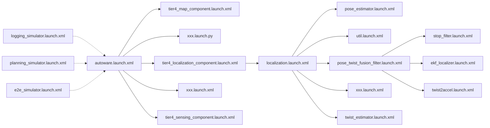

# Launch 文件

## 概述

Autoware 使用 ROS 2 launch 系统启动软件。如果不熟悉 ROS 2 launch 系统，请先阅读[官方文档](https://docs.ros.org/en/humble/Tutorials/Intermediate/Launch/Launch-Main.html)，了解基本概念。

## 指南

### Autoware 中 launch 文件的组织方式

Autoware 将可复用的节点实现与其集成示例区分开来，集成示例包含系统特定配置、处理流水线和系统拓扑。

- 可复用的节点实现位于 [`autoware_core`](https://github.com/autowarefoundation/autoware_core) 和 [`autoware_universe`](https://github.com/autowarefoundation/autoware_universe)。
  - `autoware_core` 仓库本身在名为 `autoware_core` 的功能包中提供了最小集成方案。
- 由这些节点组织而成的集成系统示例位于 [`autoware_launch`](https://github.com/autowarefoundation/autoware_launch)。
  - 完整的自动驾驶系统有多种构建方式，`autoware_launch` 提供了其中一种可高度配置的参考集成方案。

`autoware_launch` 功能包本身提供通用入口，用于调用其他模块化 launch 文件并启动 Autoware 节点。

- `autoware.launch.xml` 是道路驾驶场景的基础 launch 文件。

  此文件会加载_车辆_、_系统_、_地图_、_传感_、_定位_、_感知_、_规划_、_控制_等模块的 launch 文件。将 `launch_*` 参数设置为 `true` 或 `false`，用户即可有选择地加载系统的部分模块。

- `logging_simulator.launch.xml` 通常配合已录制的 ROS bag 使用，用于调试目标模块（例如_传感_、_定位_或_感知_）是否正常工作。

- `planning_simulator.launch.xml` 基于 Planning Simulator 工具，主要通过模拟交通规则、与动态物体的交互以及对自车的控制命令，测试和验证_规划_模块。

- `e2e_simulator.launch.xml` 是数字孪生仿真环境的启动器。

### 在 Autoware 中添加新功能包

如果新建功能包包含可执行节点，应在包内提供示例 launch 文件和配置，就像前面的[目录结构](../../../contributing/coding-guidelines/ros-nodes/directory-structure.md)页面所推荐的结构一样。

### 将新功能包集成到 `autoware_launch`

为了在启动 Autoware 时自动加载新添加的功能包（位于 `autoware_core` 或 `autoware_universe`），需要对相应的 launch 文件进行必要修改。

## 参数与系统拓扑管理

引入 `autoware_launch` 仓库的另一个目的，是便于管理 Autoware 的参数和系统拓扑。

假设我们希望基于 `autoware_launch` 将 Autoware 集成到特定车辆上，只需要调整参数以及可能的节点配置，而不重写现有节点实现。
这种情况下，可以**仅 fork `autoware_launch`** 来定制参数或处理流水线，无须修改官方的 `autoware_universe`。

以定位模块为例，在 `autoware_launch` 仓库中：

1. 定位组件的所有启动参数文件都列在 `autoware_launch/config/localization` 下的文件中。
2. 启动参数文件的路径在 `autoware_launch/launch/components/tier4_localization_component.launch.xml` 中设置。
3. 在 `tier4_universe_launch/tier4_localization_launch/launch` 中，如果参数配置文件提供了相应实参，launch 文件就会加载对应的启动参数文件。你仍可使用各功能包的默认参数启动 `tier4_localization_launch`。

有关如何更新这些启动参数文件，请参阅 [sync-params](../../../contributing/coding-guidelines/ros-nodes/parameters.md#sync-params)。
