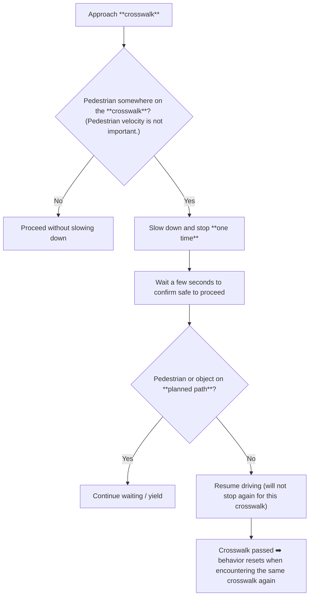

# 驶过人行横道

驶过人行横道时，自车会**同时**评估行人／物体的存在情况**以及**相关交通信号灯的状态。

!!! info

    更多技术细节请参阅 [**autoware_behavior_velocity_crosswalk_module** 文档](https://autowarefoundation.github.io/autoware_universe/main/planning/behavior_velocity_planner/autoware_behavior_velocity_crosswalk_module/)。

!!! info

    这些示例使用 **Nishishinjuku** 地图，与[变道场景](lane-change.md)所用地图相同。

!!! tip

    在这些教程中，使用**可交互的虚拟行人**更方便（参见上文[放置可交互的虚拟物体](placing-objects.md)）。

    这样可以按需快速添加、移动和删除虚拟行人。

## 无信号灯的人行横道

### 行为逻辑

!!! example "实验"

    我们将验证预期的“停车一次后继续行驶”行为：

    1. 在人行横道上放置一个静止的虚拟行人。（不在规划路径上，只需位于人行横道上。）

    2. 自车会减速并在人行横道前停车。

    3. 等待几秒后，自车会恢复正常行驶。

1. 设置自车的初始位姿和目标位姿，使其经过一个无信号灯的人行横道。系统会规划出一条路径。

   

2. 在人行横道上放置一个可交互的虚拟行人，并将其位姿设为正在横穿道路的姿态。只要虚拟行人位于人行横道上，是否处于运动状态并不影响本实验。

   

3. 点击 `Auto` 启动自车。自车会减速并在人行横道前停车。图中标记的 **crosswalk** 表示停车行为由**人行横道**上的物体触发。

   

4. 自车会等待几秒，然后重新起步并通过人行横道。

   

## 有信号灯的人行横道

<figure markdown="span">
  
  <figcaption>有信号灯的人行横道实验位置</figcaption>
</figure>

!!! example "实验 1：绿灯时存在行人"

    本实验与上一个实验相似，但在有信号灯的人行横道上进行。

当行人位于路径附近且交通信号灯为**绿灯**时，自车的行为**与在无信号灯的人行横道处相同**：
减速、停车、等待，然后继续行驶。

!!! example "实验 2：行人与红灯的共同影响"

    1. 将交通信号灯设为 `RED`，使自车在人行横道前停车。（不放置行人。）

    2. 在交通信号灯为 `RED` 时，向人行横道上添加一个虚拟行人。（信号灯和人行横道都应影响停车行为。）

    3. 最后，将交通信号灯重新设为 `GREEN`，车辆将正常通过。

1. **红灯停车（无行人）。**
   移除所有现有虚拟行人，并将交通信号灯设为 **RED**。
   自车会在人行横道前停车并等待，此时唯一的停车原因是 **traffic_light**。

   

2. **红灯时添加行人。**
   自车继续停车，此时**同时**受到信号灯和人行横道上物体的影响。

   

3. **观察停车原因的变化。**
   短暂等待后，界面可能只显示 **traffic_light**。
   使用 ++shift+"🖱️ Right Click"++ 拖动行人，使其稍微移动，会再次显示两个标记；但在等待过程中，系统会稳定回到仅显示交通信号灯这一停车原因的状态。

   

4. **将信号灯切换为 GREEN。**
   信号灯设为绿灯并启用 `Auto` 模式后，自车会正常行驶。

   
