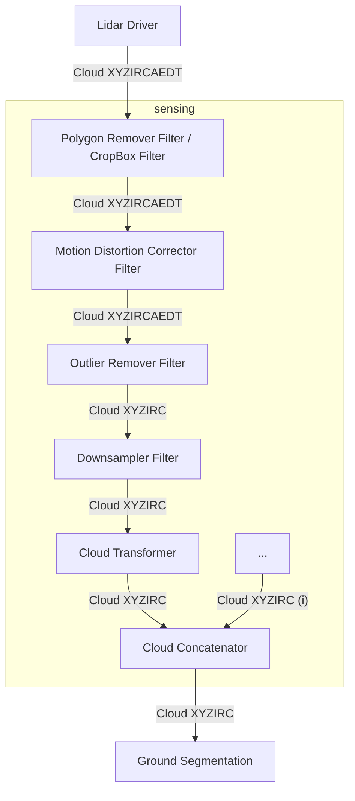

# 点云预处理设计

## 概述

点云预处理由一组对原始传感器数据执行基础预处理的模块组成。

此流水线覆盖从驱动程序到感知栈的数据流。

## 推荐处理流水线

## 模块列表

此处使用的模块来自 [pointcloud_preprocessor 软件包](https://github.com/autowarefoundation/autoware_universe/tree/main/sensing/autoware_pointcloud_preprocessor)。

模块详情见[下表](https://github.com/autowarefoundation/autoware_universe/tree/main/sensing/autoware_pointcloud_preprocessor#inner-workings--algorithms)。

建议将这些模块作为组件放在同一容器中使用。详情见 [ROS 2 组件组合](https://docs.ros.org/en/rolling/Tutorials/Intermediate/Composition.html)

## 点云字段

激光雷达驱动程序应输出点类型为 `PointXYZIRCAEDT` 的点云。

| 名称 | 数据类型 | 是否派生 | 说明 |
| ----------------- | --------- | ------- | ---------------------------------------------------------------------------- |
| `X` | `FLOAT32` | `false` | X 位置 |
| `Y` | `FLOAT32` | `false` | Y 位置 |
| `Z` | `FLOAT32` | `false` | Z 位置 |
| `I`（强度） | `UINT8` | `false` | 测得的反射率，即点的强度 |
| `R`（回波类型） | `UINT8` | `false` | 双回波激光雷达的激光回波类型 |
| `C`（通道） | `UINT16` | `false` | 测量该点的激光通道 ID |
| `A`（方位角） | `FLOAT32` | `true` | `atan2(Y, X)`，从激光雷达原点到该点的水平角 |
| `E`（仰角） | `FLOAT32` | `true` | `atan2(Z, D)`，从激光雷达原点到该点的垂直角 |
| `D`（距离） | `FLOAT32` | `true` | `hypot(X, Y, Z)`，从激光雷达原点到该点的欧氏距离 |
| `T`（时间） | `UINT32` | `false` | 测量该点时相对于消息头时间经过的纳秒数 |

!!! note

    `A (azimuth)`、`E (elevation)` 和 `D (distance)` 字段是派生字段。
    驱动程序提供这些字段，以减轻感知栈部分模块的计算负担。

!!! warning

    Autoware 支持将 `PointXYZI` 转换为 `PointXYZIRC`（通道和回波类型均设为 0），以便进行原型开发。
    但此转换效率较低，不建议用于生产环境。

### 强度

我们使用以下强度范围，与 [VLP16 用户手册](https://usermanual.wiki/Pdf/VLP16Manual.1719942037/view)兼容：

引自 VLP-16 用户手册：

> For each laser measurement, a reflectivity byte is returned in addition to distance.
> Reflectivity byte values are segmented into two ranges, allowing software to distinguish diffuse reflectors
> (e.g. tree trunks, clothing) in the low range from retroreflectors (e.g. road signs, license plates) in the high range.
> A retroreflector reflects light back to its source with a minimum of scattering.
> The VLP-16 provides its own light, with negligible separation between transmitting laser and receiving detector, so
> retroreflecting surfaces pop with reflected IR light compared to diffuse reflectors that tend to scatter reflected energy.
>
> - Diffuse reflectors report values from 0 to 100 for reflectivities from 0% to 100%.
> - Retroreflectors report values from 101 to 255, where 255 represents an ideal reflection.

在不含逆反射体的典型点云中，所有点的强度均介于 0 到 100 之间。

[逆反射渐变道路标志，图片来源](https://commons.wikimedia.org/wiki/File:Retroreflective_Gradient_road_sign.jpg)

但在含有逆反射体的点云中，点的强度介于 0 到 255 之间。

#### 其他激光雷达品牌的强度映射

##### Hesai PandarXT16

[Hesai Pandar XT16 用户手册](https://www.hesaitech.com/wp-content/uploads/2025/04/PandarXT-16_User_Manual_X02-en-250410.pdf)

此激光雷达有 2 种反射率输出模式：

- 线性映射
- 非线性映射

使用线性映射模式时，构建点云应将 [0, 255] 映射到 [0, 100]。

使用非线性映射模式时，构建点云应进行以下映射（从 hesai 到 autoware）：

- 将 [0, 251] 映射到 [0, 100]，并且
- 将 [252, 254] 映射到 [101, 255]

在构建点云时应用上述映射。

##### Livox Mid-70

[Livox Mid-70 用户手册](https://terra-1-g.djicdn.com/65c028cd298f4669a7f0e40e50ba1131/Download/Mid-70/new/Livox%20Mid-70%20User%20Manual_EN_v1.2.pdf)

此激光雷达与 Velodyne VLP-16 类似，有 2 种反射率输出模式，只是范围略有不同。

应进行以下映射（从 livox 到 autoware）：

- 将 [0, 150] 映射到 [0, 100]，并且
- 将 [151, 255] 映射到 [101, 255]

在构建点云时应用上述映射。

##### RoboSense RS-LiDAR-16

[RoboSense RS-LiDAR-16 用户手册](https://cdn.robosense.cn/20200723161715_42428.pdf)

无需映射，与 Velodyne VLP-16 相同。

##### Ouster OS-1-64

[所有 Ouster 传感器的软件用户手册 v2.0.0](https://data.ouster.io/downloads/software-user-manual/software-user-manual-v2p0.pdf)

手册中说明：

> Reflectivity [16 bit unsigned int] - sensor Signal Photons measurements are scaled based on measured range and sensor sensitivity at that range, providing an indication of target reflectivity. Calibration of this measurement has not currently been rigorously implemented, but this will be updated in a future firmware release.

因此，建议将 16 位反射率映射到 [0, 100] 范围。

##### Leishen CH64W

[未能获取英文用户手册，参见网站链接](http://www.lslidar.com/en/down)

在找到的一份用户手册中说明：

> Byte 7 represents echo strength, and the value range is 0-255. (Echo strength can reflect
> the energy reflection characteristics of the measured object in the actual measurement
> environment. Therefore, the echo strength can be used to distinguish objects with
> different reflection characteristics.)

因此，建议将 [0, 255] 映射到 [0, 100] 范围。

### 回波类型

各种激光雷达支持多种回波模式。Velodyne 激光雷达支持**最强回波**和**最后回波**模式。

在 `PointXYZIRC` 和 `PointXYZIRCAEDT` 类型中，`R` 字段使用 `UINT8` 表示回波类型。
回波类型由厂商定义。下表给出了回波类型定义示例。

| R（回波类型） | 说明 |
| --------------- | -------------------- |
| `0` | 未知 / 未标记 |
| `1` | 最强回波 |
| `2` | 最后回波 |

### 通道

通道字段用于标识测量该点的激光垂直通道。
在不同激光雷达手册或文献中，也称为 _laser id_、_ring_ 或 _laser line_。

Velodyne VLP-16 有 16 个通道。驱动程序中默认通道顺序通常为发射顺序。

在 `PointXYZIRC` 和 `PointXYZIRCAEDT` 类型中，`C` 字段使用 `UINT16` 表示垂直通道 ID。

### 方位角

方位角字段给出激光雷达光学原点到该点的水平角。
许多激光雷达根据激光发射时旋转编码器的角度进行测量，驱动程序通常根据标定数据修正该值。

在 `PointXYZIRCAEDT` 类型中，`A` 字段使用 `FLOAT32` 表示以弧度为单位的方位角（顺时针方向）。

### 仰角

仰角字段给出激光雷达光学原点到该点的垂直角。
在 `PointXYZIRCAEDT` 类型中，`E` 字段使用 `FLOAT32` 表示以弧度为单位的仰角（顺时针方向）。

#### 固态和花瓣扫描模式激光雷达

!!! warning

    本节内容可能变化。以下为建议，欢迎讨论。

对于具有扫描线的固态激光雷达，将行号作为通道 ID。

对于花瓣扫描模式激光雷达，可以将通道保持为 0。

### 时间戳

激光雷达点云中的每个测量点都可以有自己的时间戳。
此信息可用于消除扫描过程中激光雷达运动造成的运动畸变。

#### 点云消息头时间

消息头包含一个 [Time 字段](https://github.com/ros2/rcl_interfaces/blob/rolling/builtin_interfaces/msg/Time.msg)。
时间字段包含 2 个部分：

| 字段 | 类型 | 说明 |
| --------- | -------- | ------------------------------------------------- |
| `sec` | `int32` | Unix 时间（自 1970 年 1 月 1 日起经过的秒数） |
| `nanosec` | `uint32` | 自 `sec` 字段所示时间起经过的纳秒数 |

点云消息头应包含该点云中最早点的时间。

!!! note

    ROS 2 humble 中的 `sec` 字段为 `int32`。它能表示的最大值为 2^31 秒，因此存在
    2038 年问题。我们将等待 ROS 2 社区采取措施。

    **更多信息：** https://github.com/ros2/rcl_interfaces/issues/85

#### 单点时间戳

每个 `PointXYZIRCAEDT` 点类型都含有 `T` 字段，表示相对于点云中首个发射点经过的纳秒数。

要计算各点的准确发射时间，将 `T` 纳秒加到消息头时间即可。

!!! note

    `T` 字段类型为 `uint32`。它能表示的最大值为 2^32 纳秒，约等于
    4.29 秒。通常点云完整扫描周期不超过 100ms，因此该字段足够使用。
