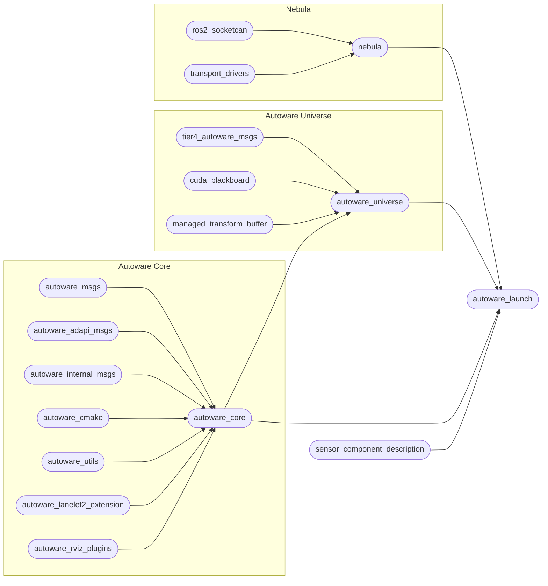

# 仓库结构

## 概述

!!! info "`repositories/*.repos` 文件"

    更多信息请参阅：[使用 .repos 文件](repos-files.md){ .md-button }

Autoware 具有以下仓库结构，由 [`autoware.repos`](https://github.com/autowarefoundation/autoware/blob/main/repositories/autoware.repos) 文件定义：

!!! note

    为使图示简洁，省略了部分仓库。

## 重要仓库

以下概述最重要的几个仓库：

### `autoware_core`

- 包含自动驾驶必需的高质量、经过充分测试的功能包。
- 包含传感器处理、感知、定位、规划和控制功能包。
- 由 Autoware 基金会维护。

### `autoware_universe`

- 包含对自动驾驶有用的实验性前沿功能包。
- 包含传感器处理、感知、定位、规划和控制功能包。
- 由 Autoware 基金会和社区共同维护。
  - 托管在 autowarefoundation 组织下，同时社区可通过 `CODEOWNERS` 机制参与仓库维护。

### `autoware_msgs`

- 包含**组件间**通信的消息定义。（例如感知与规划之间的通信。）
- 仿真软件也可以使用这些消息与 Autoware 通信。

### `autoware_internal_msgs`

- 包含**组件内部**通信的消息定义。（例如感知组件内部。）

### `autoware_adapi_msgs`

- 包含 Autoware 与**外部系统**之间进行**外部 API 通信**的消息定义  
  （例如车辆 HMI、远程操作员、车队管理系统、仿真器或用户应用）

### `autoware_launch`

- 包含 Autoware 的启动文件。
- 可启动规划仿真、端到端仿真、rosbag 回放仿真等多种 Autoware 配置。

### `autoware_tools`

- 包含许多用于 Autoware 开发的实用工具。
- 这些工具通常不在自动驾驶运行期间使用，不过部分工具有助于诊断和调试。
- 通过 [`repositories/tools.repos`](https://github.com/autowarefoundation/autoware/blob/main/repositories/tools.repos) 导入。

### `autoware_utils`

- 包含多个通用工具子包，例如 `autoware_utils_math`、`autoware_utils_geometry`、`autoware_utils_system` 等。
