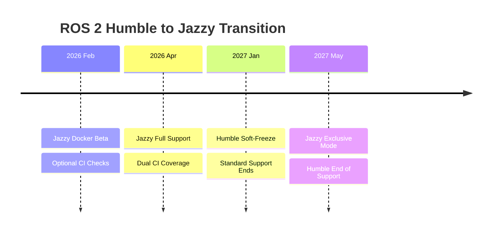
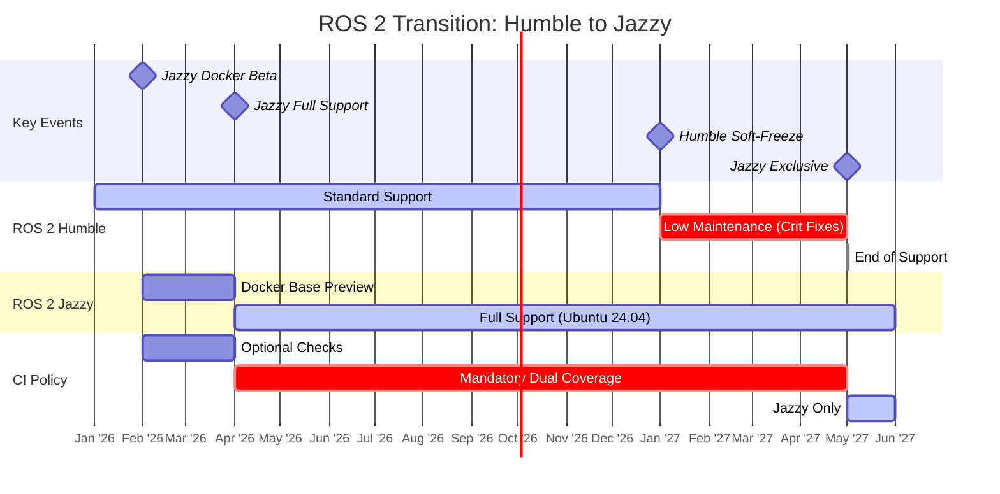

# 从 ROS 2 Humble 迁移到 Jazzy

进度跟踪见 [支持 ROS 2 Jazzy Jalisco #6695](https://github.com/autowarefoundation/autoware/issues/6695)。

- ROS 2 Humble 将于 2027 年 5 月结束支持。
- ROS 2 Jazzy 已于 2024 年 5 月发布，支持将持续到 2029 年 5 月。

此时间表用于 Autoware 的平台迁移：

- **原平台：** Ubuntu 22.04 | ROS 2 **Humble**
- **目标平台：** Ubuntu 24.04 | ROS 2 **Jazzy**

