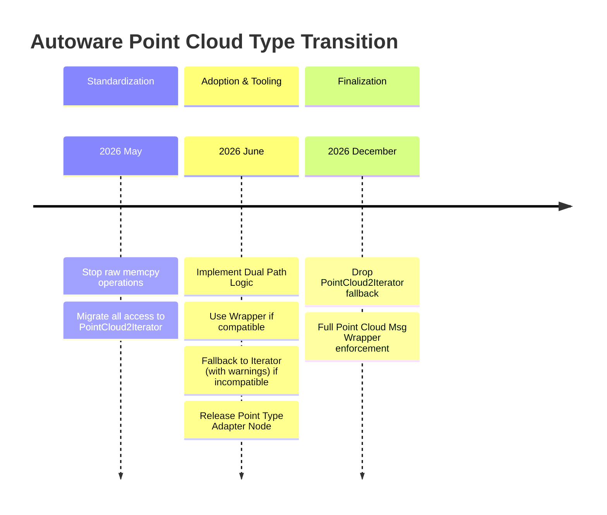
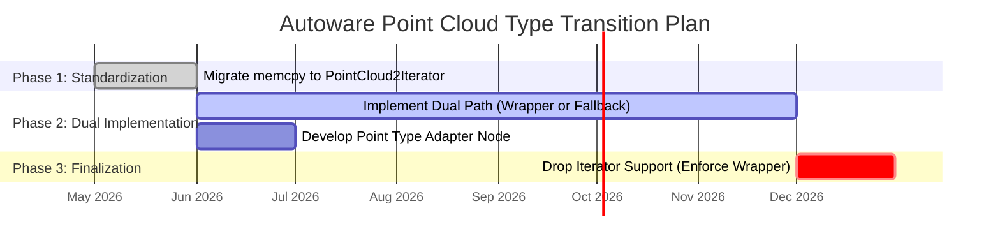

# 点云类型迁移

进度跟踪见[此议题](https://github.com/autowarefoundation/autoware/issues/6708)。

Autoware 将从直接使用 memcpy 操作和 [PointCloud2Iterator<>](https://github.com/ros2/common_interfaces/blob/jazzy/sensor_msgs/include/sensor_msgs/point_cloud2_iterator.hpp)，迁移到使用 [Point Cloud Message Wrapper](https://gitlab.com/ApexAI/point_cloud_msg_wrapper)。

这样就可以通过类似 `std::vector<>` 的封装器原地编辑点云消息。

唯一的缺点是需要为点云消息字段提供强类型定义。

我们已通过[此 PR](https://github.com/autowarefoundation/autoware_universe/pull/6996)规定了 `PointXYZIRC` 和 `PointXYZIRCAEDT` 类型的兼容性要求。

接下来需要在代码库的其他部分开始使用此封装器。

还需要提供工具，将外部类型的点云消息转换为 Autoware 期望的类型。

点类型适配节点的参考实现[见此处](https://gitlab.com/autowarefoundation/autoware.auto/AutowareAuto/-/blob/master/src/tools/point_type_adapter/src/point_type_adapter_node.cpp)。

## 迁移计划

1. **2026 年 5 月：** 将所有 memcpy 的使用改为 `PointCloud2Iterator<>`。
2. **2026 年 6 月：** 为代码库增加两条处理路径：检查点类型与期望点类型是否完全兼容。
   - 如果兼容，使用封装器。
   - 如果不兼容，使用 `PointCloud2Iterator<>` 并输出警告。
3. **2026 年 6 月：** 增加节点，将外部类型的点云消息转换为 Autoware 期望的类型。
4. **2026 年 12 月：** 停止使用 `PointCloud2Iterator<>`。

!!! warning

    正在编写。
